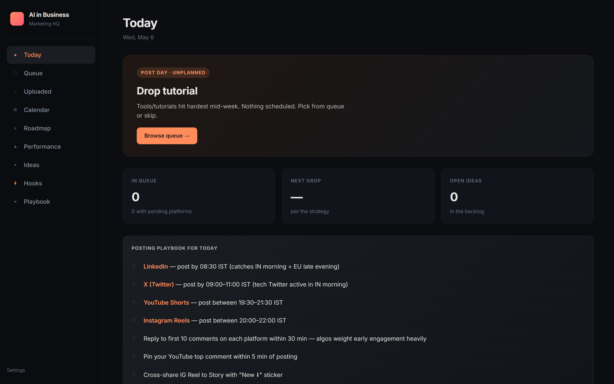
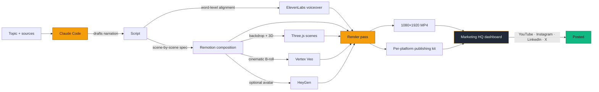
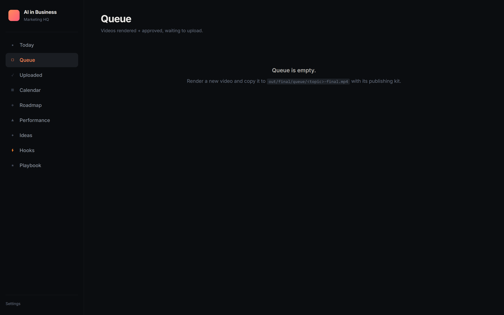
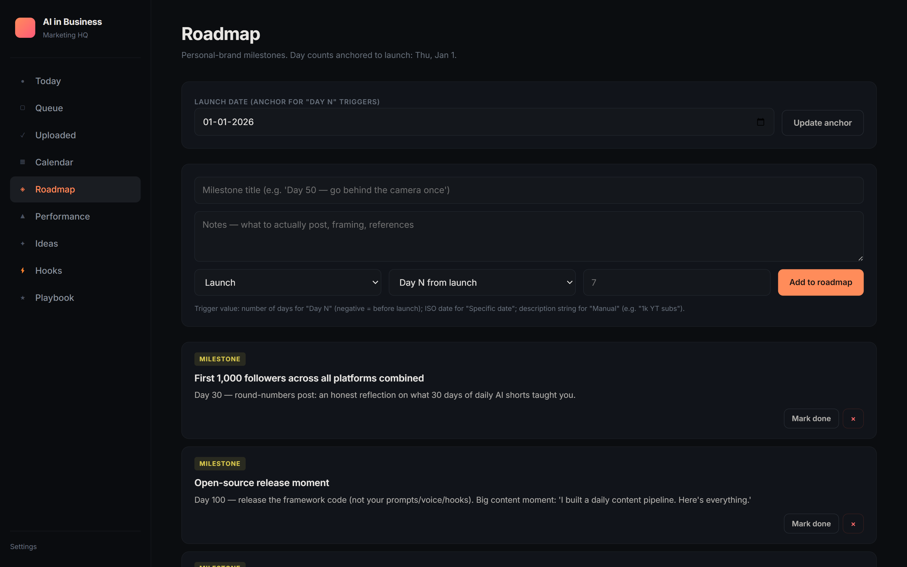
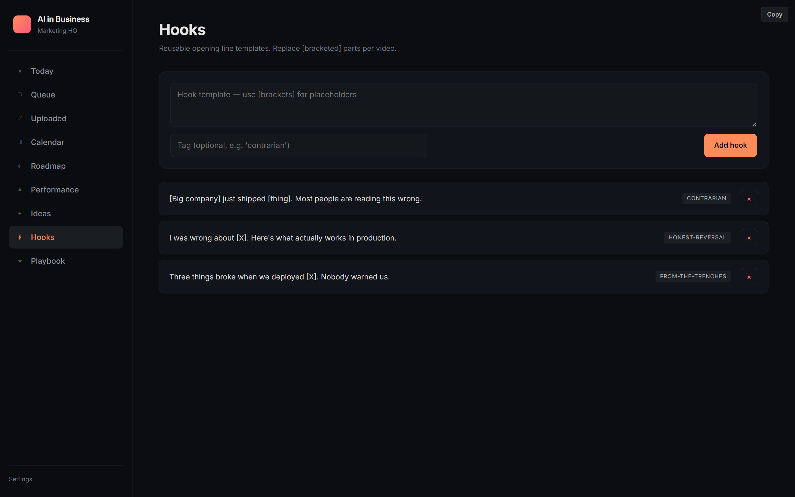
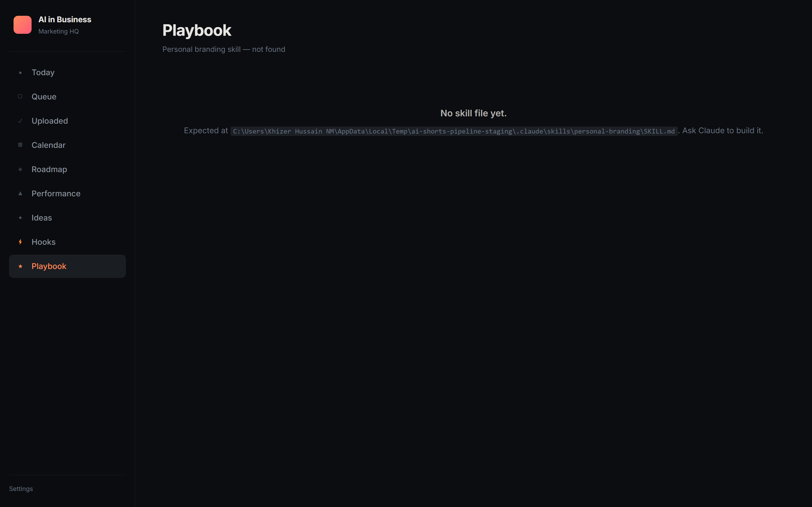
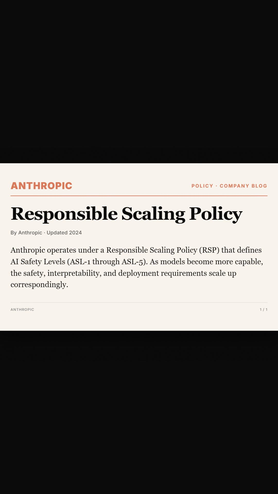

# ai-shorts-pipeline

For anyone whose calendar is full but whose audience still expects to hear from them.

Daily content has become a tax on every operator, founder, and builder trying to grow a name. Most days you don't have an hour to record, edit, caption, and post. **ai-shorts-pipeline automates the production so you can keep showing up — even on the days you can't.** The point isn't to make videos faster for fun. The point is **consistency** for the people whose real job isn't creating content but who still need to.

It's a Claude Code skill. You give it a topic and a couple of source links. It hands back a finished 60-second vertical video, a voiceover in your cloned voice, and per-platform captions for YouTube Shorts, Instagram Reels, LinkedIn, and X. ~5–7 minutes per video on a normal laptop.



Under the hood, the skill orchestrates these moving parts in a single render pass:

- **ElevenLabs** for voiceover (your cloned voice), with word-level timestamp alignment
- **Vertex Veo** for cinematic B-roll (text-to-video and Imagen→Veo image-to-video)
- **Three.js** for custom 3D scenes — particle systems, brand strikethroughs, data-viz
- **Remotion** for everything else: composition, timing, encoding, frame extraction
- **HeyGen** *(optional)* for presenter-led avatar segments at the hook and CTA

Plus a local-only **marketing HQ dashboard** (multi-page Express app) for queue management, posting cadence, and per-platform publishing kits with copy-buttons and char-limit enforcement.

Battle-tested on [@AIinBusiness](https://youtube.com/@AIinBusiness) — daily videos rendered by this exact pipeline.

---

## What you get vs what you bring (read this first)

This repo is honest about what it does and doesn't do.

**What you get from cloning this repo:**
- A skill protocol Claude follows for every video — editing rules, scene grammar, pacing curves, anti-patterns, mandatory QA workflow. The decisions that took us months to settle, condensed into one file.
- A working marketing HQ dashboard you can run on `localhost`. Queue, calendar, roadmap, performance, ideas, hooks, playbook.
- The render pipeline: Remotion compositions, ~40 scene types, the Three.js primitives library, gen-audio + Veo + HeyGen helpers, the orchestrator that turns a topic into a spec, and 12 synthesized SFX. Clone, set keys, render.

**What you bring yourself:**
- Your voice clone settings (ElevenLabs stability, similarity, style — these are tuned to a specific voice and tone; yours will be different)
- Your topic-research process (which AI news matters this week, who you're writing for, the contrarian angle — that's editorial judgment, not code)
- Your hooks library (you build it as you ship and learn)
- Your performance benchmarks (your channel's 3-second retention floor, your save-to-share ratio — yours, not mine)
- The take. Always the take.

The plumbing is here. The framework gives you ~70% of the craftsmanship of *framing*. The 30% — the voice you tune, the hooks you build, the takes you bring — is what makes the channel *yours* instead of mine. That's a feature, not a gap.

For the full skill protocol — editing rules, scene grammar, anti-patterns, QA workflow — see [`SKILL.md`](./SKILL.md).

---

## How it fits together



The skill is the orchestration layer. Claude reads `SKILL.md`, picks the right scenes for each beat, generates the spec, and runs the render. The dashboard is where you actually live — queueing, scheduling, copying captions, tracking what shipped.

---

## Quick start

```bash
git clone https://github.com/Khizergenfox/ai-shorts-pipeline.git
cd ai-shorts-pipeline
npm install
cp .env.example .env
# Dashboard runs without any keys. Render pipeline (v0.2) needs ELEVENLABS_API_KEY etc.

npm run dashboard      # opens http://localhost:5173
```

The dashboard is the marketing HQ — queue, calendar, roadmap, performance, ideas, hooks, playbook. All local, all yours, no internet exposure.

---

## What the marketing HQ looks like

Multi-page Express app, no build step. Each section is its own URL so it's easy to extend (drop a route file + a view file).

### Today — day-of-week mode + posting playbook


The Today page knows what day it is and tells you what mode you're in (post / engage / ideate / rest), the one CTA, and the posting playbook for today. Posting windows per platform, engagement velocity rules, the whole thing scoped to right now.

### Queue — what's rendered and waiting



Drag-to-reorder list of rendered videos waiting to ship. Top of list = next post day. Click any video to see per-platform captions with copy buttons, live char counters on the X tweet, and a mark-posted form that promotes it to the Uploaded section.

### Roadmap — milestone-driven launch plan



Personal-brand milestones with Day-N or specific-date triggers, anchored to a launch date you set. Add milestones from the form, see them surface on the Today page when their trigger fires.

### Hooks — reusable opening-line library



Reusable opening-line templates with tags (contrarian, honest-reversal, from-the-trenches, etc.). One click to copy. You build your own library as you ship and learn what hooks land.

### Playbook — strategy notes + Lessons learned log



Marketing strategy notes and an append-only "Lessons learned" log. Every shipped video gets a one-line entry: what worked, what didn't, what to do differently. Over time this becomes the most valuable file in the repo.

---

## What comes out the other end

A single example frame from a recent rendered short, showing the news-article scene type doing its job (real publication style, real headline, scene-driven typography):



The skill enforces "literal before metaphorical" — real news article mockups before any abstract 3D explanation. Editing rules and scene grammar are in [`SKILL.md`](./SKILL.md).

---

## What's inside

- **`SKILL.md`** — the skill protocol Claude reads to render videos: editing rules, scene grammar, pacing curves, the question-to-visual decision rubric, the QA workflow, the HeyGen avatar pipeline
- **`dashboard/`** — local marketing operations (multi-page Express, no build step, drag-to-reorder queue, copy-to-clipboard captions, append-only "Lessons learned" log)
- **Render pipeline** — Remotion entry + master composition + ~40 scene type implementations
- **3D toolkit** — 18 Three.js primitives in `src/effects/three/` (BarRace, MathField, NodeNetwork, Stat3DExtrude, LogoOrbit, BloomHalo, CameraRig, RevenueTimeChart, and more) that you compose into custom `story_3d` variants for your topics
- **9 production scripts** — `render-full`, `gen-audio`, `gen-veo-broll-cinematic`, `gen-veo-from-imagen`, `gen-heygen-clip`, `poll-heygen-clips`, `render-3d`, `test-vertex-auth`, plus the shared Vertex client
- **All 12 synthesized SFX** in `public/sfx/` so renders have sound on first run (thump, riser, click, whoosh, fire-whoosh, glitch, alert-beep, success-ding, terminal-enter, notification, chart-rise, typing)
- **Example spec + example narration** — `specs/example-news.json` and `scripts/example.txt` so you can see the JSON shape and render end-to-end
- **Voice tuning is env-var driven** — `ELEVENLABS_STABILITY` / `_SIMILARITY_BOOST` / `_STYLE` / `_USE_SPEAKER_BOOST`. Defaults are ElevenLabs' neutral starting point (0.5 / 0.75 / 0.0). Tune to your cloned voice.

Clone, set keys, drop a script in `scripts/example.txt`, then:

```bash
node scripts/gen-audio.mjs scripts/example.txt example
node scripts/render-full.mjs example
```

Your first video lands in `out/example-v1.mp4`.

---

## Roadmap

- [x] **v0.1** — Skill spec, marketing HQ dashboard, example data, architecture diagram
- [x] **v0.2** — Render pipeline (Remotion compositions, render scripts, gen-audio, Veo b-roll, HeyGen avatar helpers, all SFX)
- [ ] **v0.3** — YouTube + LinkedIn + X uploaders integrated into the dashboard
- [ ] **v0.4** — Auto-fetch performance metrics from each platform's API
- [ ] **v0.5** — Voice cloning setup walkthrough

---

## Built by

[Khizer Hussain](https://github.com/Khizergenfox) · [@AIinBusiness on YouTube](https://youtube.com/@AIinBusiness)

Also building [GenFox.AI](https://genfox.ai). This is the side project I run in public, for people who want to ship daily AI content without a video team.

---

## License

MIT. Use it, fork it, ship your own channel.

If you ship something built on this, tag me — happy to boost it.
