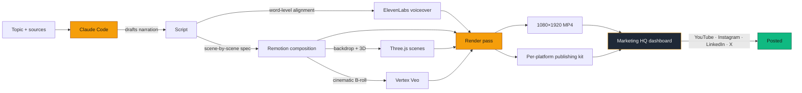

# ai-shorts-pipeline

A Claude Code skill that turns one AI/tech topic into a finished 60-second vertical video.


Under the hood, the skill orchestrates four moving parts in a single render pass:

- **ElevenLabs** for voiceover (your cloned voice), with word-level timestamp alignment
- **Vertex Veo** for cinematic B-roll (text-to-video and Imagen→Veo image-to-video)
- **Three.js** for custom 3D scenes — particle systems, brand strikethroughs, data-viz
- **Remotion** for everything else: composition, timing, encoding, frame extraction

Plus a local-only **marketing HQ dashboard** (multi-page Express app) for queue management, posting cadence, and per-platform publishing kits with copy-buttons and char-limit enforcement.

Total time topic-to-final-MP4 on a normal laptop: **~5–7 minutes**.

Battle-tested on [@AIinBusiness](https://youtube.com/@AIinBusiness) — daily videos rendered by this exact pipeline.

---

## How it fits together



The skill is the orchestration layer. Claude reads `SKILL.md`, picks the right scenes for each beat, generates the spec, and runs the render. The dashboard is where you actually live — queueing, scheduling, copying captions, tracking what shipped.

---

## What this is, and what it isn't

**It is:** a working framework for daily short-form content. Drop it into Claude Code, give Claude a topic and a couple of source links, get back a finished 1080×1920 video, a voiceover, and per-platform captions for YouTube / Instagram / LinkedIn / X.

**It isn't:** a turnkey channel. The framework handles plumbing — what the videos *look like*, how they're paced, how they're encoded. The parts that make a channel *yours* (voice tuning, topic-research, hook calibration, the take you bring) you build yourself. That's a feature, not a gap.

For the full skill protocol — editing rules, scene grammar, anti-patterns, QA workflow — see [`SKILL.md`](./SKILL.md).

---

## Quick start

```bash
git clone https://github.com/Khizergenfox/ai-shorts-pipeline.git
cd ai-shorts-pipeline
npm install
cp .env.example .env
# The dashboard runs without any keys. Render pipeline (v0.2) needs ELEVENLABS_API_KEY etc.

npm run dashboard      # opens http://localhost:5173
```

The dashboard is the marketing HQ — queue, calendar, roadmap, performance, ideas, hooks, playbook. All local, all yours, no internet exposure.

---

## What the marketing HQ looks like

Multi-page Express app, no build step. Each section is its own URL so it's easy to extend (drop a route file + a view file).

### Today — day-of-week mode + posting playbook


The Today page knows what day it is and tells you what mode you're in (post / engage / ideate / rest), the one CTA, and the posting playbook for today. Posting windows per platform, engagement velocity rules, the whole thing scoped to right now.

### Queue — what's rendered and waiting


Drag-to-reorder list of rendered videos waiting to ship. Top of list = next post day. Click any video to see per-platform captions with copy buttons, live char counters on the X tweet, and a mark-posted form that promotes it to the Uploaded section.

### Roadmap — milestone-driven launch plan


Personal-brand milestones with Day-N or specific-date triggers, anchored to a launch date you set. Add milestones from the form, see them surface on the Today page when their trigger fires.

### Hooks — reusable opening-line library


Reusable opening-line templates with tags (contrarian, honest-reversal, from-the-trenches, etc.). One click to copy. You build your own library as you ship and learn what hooks land.

### Playbook — strategy notes + Lessons learned log


Marketing strategy notes and an append-only "Lessons learned" log. Every shipped video gets a one-line entry: what worked, what didn't, what to do differently. Over time this becomes the most valuable file in the repo.

---

## What comes out the other end

A single example frame from a recent rendered short, showing the news-article scene type doing its job (real publication style, real headline, scene-driven typography):


The skill enforces "literal before metaphorical" — real news article mockups before any abstract 3D explanation. Editing rules and scene grammar are in [`SKILL.md`](./SKILL.md).

---

## What's in this release (v0.1.0)

- ✅ `SKILL.md` — the full skill protocol Claude reads to render videos
- ✅ `dashboard/` — local marketing operations (multi-page Express, no build step, drag-to-reorder queue, copy-to-clipboard captions, append-only "Lessons learned" log)
- ✅ Example data files so the dashboard runs immediately on first clone
- ✅ Example spec in `specs/` so you can see the JSON shape Claude generates
- ⏳ Render pipeline (Remotion compositions, render scripts, gen-audio, gen-veo helpers) — **coming in v0.2** with proper sanitization and example assets

The skill spec + dashboard alone is enough to start running a real content operation today. The render pipeline drops in v0.2.

---

## Roadmap

- [x] **v0.1.0** — Skill spec, marketing HQ dashboard, example data, architecture diagram
- [ ] **v0.2.0** — Render pipeline (Remotion compositions, render-full.mjs, gen-audio.mjs, Veo b-roll helpers)
- [ ] **v0.3.0** — YouTube + LinkedIn + X uploaders integrated into dashboard
- [ ] **v0.4.0** — Auto-fetch performance metrics from each platform's API
- [ ] **v0.5.0** — Voice cloning setup walkthrough

---

## Built by

[Khizer Hussain](https://github.com/Khizergenfox) · [@AIinBusiness on YouTube](https://youtube.com/@AIinBusiness)

Also building [GenFox.AI](https://genfox.ai). This is the side project I run in public, for people who want to ship daily AI content without a video team.

---

## License

MIT. Use it, fork it, ship your own channel.

If you ship something built on this, tag me — happy to boost it.
